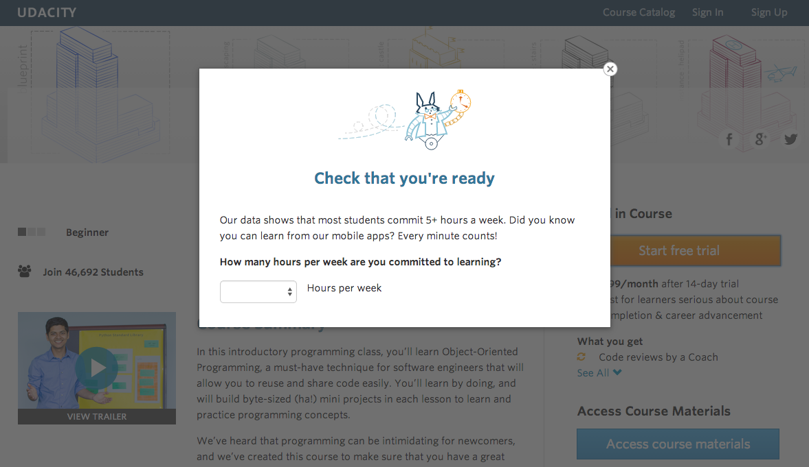

# Udacity AB testing Experiment



This repo contains code for an AB testing experiment. The experiment is a replica of one that the online educational platform "Udacity" has performed in order to test the significance of a change to its free trial subscription procedure.

---

### 📜 Requirements

The code requires the following packages to be installed:

- numpy
- pandas
- scipy

If you don’t have all or part of them installed, you may consider run one of the following commands:
<br/>    
<br/>
💡 It is always recommended to try out code in a virtual environment. So you may start with a fresh virtual-env or activate a pre-existing one, if you want. Then run one of the following commands 👇
<br/>    
<br/>
1-  `pip`

```bash
pip install -r requirements.txt
```

2- `conda`

```bash
conda install --file requirements.txt
```